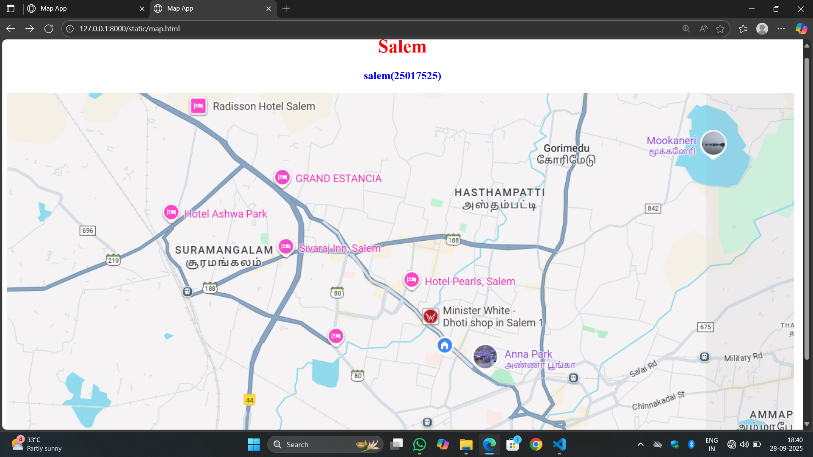

# Ex04 Places Around Me
## Date: 28/09/2025

## AIM
To develop a website to display details about the places around my house.

## DESIGN STEPS

### STEP 1
Create a Django admin interface.

### STEP 2
Download your city map from Google.

### STEP 3
Using ```<map>``` tag name the map.

### STEP 4
Create clickable regions in the image using ```<area>``` tag.

### STEP 5
Write HTML programs for all the regions identified.

### STEP 6
Execute the programs and publish them.

## CODE
```
map.html

<html>
    <head>
        <title>Map App</title>
    </head>
    <body>
        <h1 style="color:red" align="center" >Salem </h1>
        <h3 style="color:blue" align="center">salem(25017525)</h1>


<map name="image-map">
    <area target="" alt="grand estancia" title="grand estancia" href="grand.html" coords="444,123,557,191" shape="rect">
    <area target="" alt="hotel pearls " title="hotel pearls " href="hotel.html" coords="277,205,66" shape="circle">
    <area target="" alt="Anna park" title="Anna park" href="anna.html" coords="764,417,958,520" shape="rect">
    <area target="" alt="sivaraj hospital" title="sivaraj hospital" href="sivaraj.html" coords="484,258,57" shape="circle">
    <area target="" alt="Gorimedu " title="Gorimedu " href="Gorimedu.html" coords="895,58,1019,53,1024,136,963,151,883,122" shape="poly">
</map>
</body>
</html>

anna.html
<html>
    <head>
        <title>Anna Park</title>
    </head>
    <body bgcolor="yellow">
        <h1 style="color:red" align="center" >Salem</h1>
        <h3 style="color:blue" align="center" >Anna Park</h3>
    <hr>
    <p>
New Anna Park after renovation having Lots of New Attractions Like Snow Park (first Time in Salem) People can Enjoy Real Snow in-7 degree temperature, Musical Fountain, Manmade Water Fall, Rain Dance Amusement Rides, Water Rides Open air Theater and much more. Best to Visit with Family and Friends
    </p>
        
    </body>
</html>

Gorimedu.html
<html>
    <head>
        <title>Gorimedu</title>
    </head>
    <body bgcolor="cyan">
        <h1 style="color:red" align="center" >Salem</h1>
        <h3 style="color:blue" align="center" >Gorimedu</h3>
    <hr>
    <p>
        Gorimedu is a residential area and a recognized locality within the Salem district of Tamil Nadu, India. It is known for housing educational institutions, such as Narayana E-Techno School, and is situated in a region celebrated for its steel production, textile industry, and natural beauty.
    </p>
        
    </body>
</html>

grand.html
<html>
    <head>
        <title>Grand Estancia</title>
    </head>
    <body bgcolor="orange">
        <h1 style="color:red" align="center" >Salem</h1>
        <h3 style="color:blue" align="center" >Grand Estancia</h3>
    <hr>
    <p>
    </p>
Grand Estancia is a 4-star Art Deco hotel located on the Bangalore bye-pass road in Salem, Tamil Nadu, India. It features numerous amenities, including an on-site spa, a kids' play area, a gym, a pool, and multiple restaurants and bars. The hotel also offers banqueting facilities, a 24-hour front desk, airport shuttles, and free Wi-Fi, making it a suitable option for both business and leisure travelers.
    </body>
</html>

hotal.html
<html>
    <head>
        <title>Hotal</title>
    </head>
    <body bgcolor="gold">
        <h1 style="color:black" align="center" >Salem</h1>
        <h3 style="color:blue" align="center" >Hotal</h3>
    <hr>
    <p>
Hotel Ashwa Park is a 3-star hotel located in Jagir Reddipatty, Salem, in the Salem District of Tamil Nadu, India, offering amenities such as a restaurant, bar, banquet halls, a fitness center, and a swimming pool. The hotel is known for its spacious rooms, good food, and cooperative staff, though some reviews mention issues with hygiene and malfunctioning amenities. It provides features like complimentary breakfast, free Wi-Fi, 24-hour room service, and complimentary parking
    </p>
        
    </body>
</html>

sivaraj.html
<html>
    <head>
        <title>Sivaraj</title>
    </head>
    <body bgcolor="green">
        <h1 style="color:red" align="center" >Salem</h1>
        <h3 style="color:blue" align="center" >Sivaraj</h3>
    <hr>
    <p>
        Sivaraj Inn Welcomes you to a world of hospitality filled with grand tradition, culture and heritage and excellent service. We are located in the heart of the city, with all strategic locations within the reach. We always try to serve you beyond your expectations, after all excellence is a journey. The Sivaraj Inn is a Luxury Hotel with 78 well-appointed rooms catering high quality executive business facilities and devoted attention to all your needs for your luxurious accommodation in Salem, Tamilnadu, India. Sivaraj Inn is one of the Best Hotels in Salem situated just 2 kilometres from the bus stand and 1 kilometre from Salem Junction Railway station.
    </p>
        
    </body>
</html>
```
## OUTPUT

.png>)
.png>)
.png>)
.png>)
.png>)
## RESULT
The program for implementing image maps using HTML is executed successfully.
